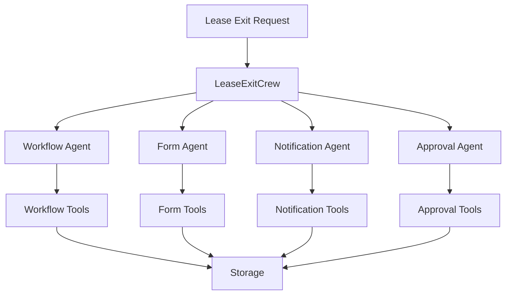
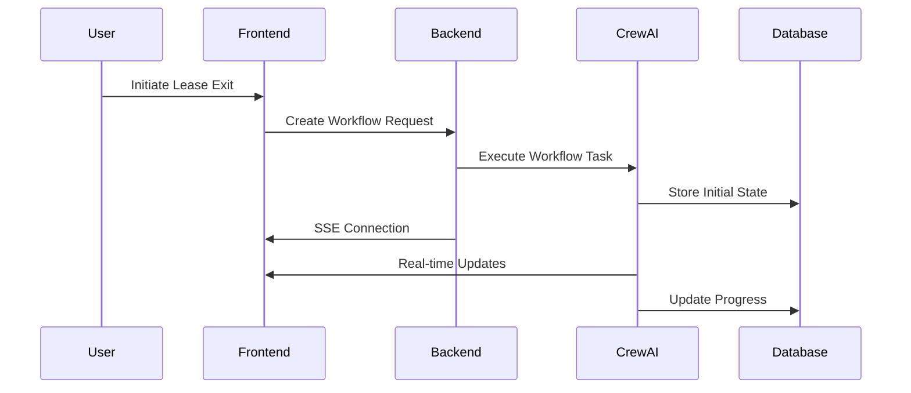
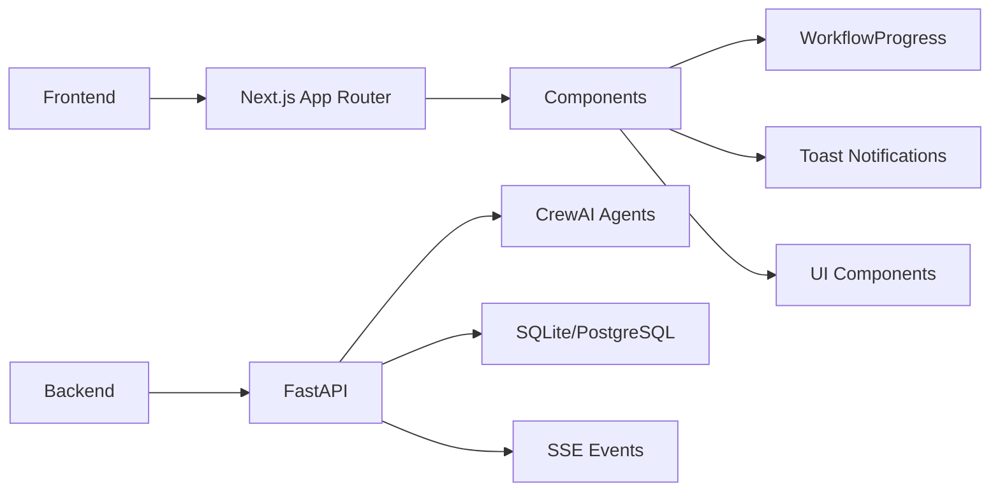

# Flow.AI - Lease Exit Workflow Management System

An AI-powered workflow management platform specifically designed to handle lease exit processes. Built using Crew AI agents for orchestrating workflows and integrating with a persistent database for data storage.

## Features

- Dynamic workflow generation and management
- Form processing and validation
- Real-time notifications using Server-Sent Events (SSE)
- Approval chain management
- Document handling
- Role-based access control
- Modern UI with toast notifications and progress tracking
- Real-time workflow status updates

## System Architecture

### AI Agent Flow


### Task Flow


### Component Architecture


## Prerequisites

- Python 3.8 or higher
- Node.js 18 or higher
- npm or yarn
- Anthropic API key

## Backend Setup

1. Navigate to the backend directory:
```bash
cd backend
```

2. Set up the virtual environment and install dependencies:

For Unix/macOS:
```bash
# Make the setup script executable
chmod +x setup.sh
# Run the setup script
./setup.sh
```

For Windows:
```bash
setup.bat
```

3. Add your API keys to the `.env` file:
```
ANTHROPIC_API_KEY=your_api_key_here
LANGCHAIN_TRACING_V2=true
LANGCHAIN_API_KEY=your_langchain_key_here
LANGCHAIN_PROJECT=crewai
```

4. Start the backend server:
```bash
# Make sure the virtual environment is activated
source venv/bin/activate  # Unix/macOS
venv\Scripts\activate     # Windows

# Start the server
python run.py
```

The backend server will be running at `http://localhost:8000`

## Frontend Setup

1. Navigate to the frontend directory:
```bash
cd frontend
```

2. Install dependencies:
```bash
npm install
# or
yarn install
```

3. Start the development server:
```bash
npm run dev
# or
yarn dev
```

The frontend will be running at `http://localhost:3000`

## Project Structure

```
.
├── backend/
│   ├── agents/             # Crew AI agents
│   │   ├── __init__.py    # LeaseExitCrew implementation
│   │   ├── workflow_agent.py
│   │   ├── form_agent.py
│   │   ├── notification_agent.py
│   │   └── approval_agent.py
│   ├── tools/             # Agent tools
│   │   ├── workflow_tools.py
│   │   ├── form_tools.py
│   │   ├── notification_tools.py
│   │   └── approval_tools.py
│   ├── main.py           # FastAPI application
│   ├── storage.py        # Database operations
│   └── requirements.txt  # Python dependencies
├── frontend/
│   ├── src/
│   │   ├── app/          # Next.js pages
│   │   │   ├── layout.tsx
│   │   │   └── workflows/
│   │   ├── components/   # React components
│   │   │   ├── ui/      # Reusable UI components
│   │   │   └── workflow/ # Workflow-specific components
│   │   └── lib/         # Utilities and helpers
│   └── package.json     # Node.js dependencies
└── README.md
```

## Key Features

### Real-time Updates
- Server-Sent Events (SSE) for live workflow progress
- Toast notifications for important updates
- Progress tracking with visual indicators

### AI Agents
- Workflow Orchestrator: Manages overall workflow lifecycle
- Form Processing Specialist: Handles form validation and processing
- Notification Manager: Manages communication with stakeholders
- Approval Chain Manager: Orchestrates approval processes

### Modern UI Components
- Progress tracking with visual indicators
- Toast notifications for updates
- Responsive layout with modern design
- Dark/Light theme support

## Development

- Backend API documentation is available at `http://localhost:8000/docs`
- The system uses SQLite for development; consider using PostgreSQL for production
- Frontend uses Next.js 14 with App Router and Server Components
- UI components are built using shadcn/ui and Tailwind CSS

## Contributing

1. Fork the repository
2. Create your feature branch (`git checkout -b feature/amazing-feature`)
3. Commit your changes (`git commit -m 'Add some amazing feature'`)
4. Push to the branch (`git push origin feature/amazing-feature`)
5. Open a Pull Request

## License

This project is licensed under the MIT License - see the LICENSE file for details 